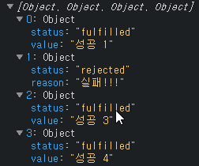

2020년이 되면서 javascript 표준 규격인 ECMA script 에도 몇가지 추가된 사항들이 생겼습니다!
\
어떤 것들이 있는지 한번 살펴보겠습니다.

<br/>

# 널 병합 연산자 (Nullish coalescing operator)

널 병합 연산자란 왼쪽에 대입되어 있는 피연산자 값이 `null` 이거나 `undefined` 일 때 오른쪽에 대입되어있는 피연산자 값이 반환되게 하는 연산자입니다.

이 널 병합 연산자가 제공되기 전의 ES버전에서라면 아마도 논리연산자 OR `||` 를 통해 기본 값을 설정하거나, `삼항연산자` 혹은 `if else`문을 통한 null 처리를 하셨을 겁니다.

```javascript
const iamNull = null
const iamUndefined = undefined


const hello = iamNull || 'world'; // OR 연산자로 기본값 처리
const hello2 = iamNull ? iamNull : 'world' // 삼항연산자로 기본값 처리

let hello3 = iamNull // if문으로 null 일때 기본 값 처리
if(!hello3) {
    hello3 = 'world'
}
```

위 예시코드에서는 큰 문제가 하나 있는데요. 그것은 `iamNull`, `iamUndefined` 의 값이 `0` 이거나 `''` 과 같은 값일 때도 `false` 로 강제 변환되기 때문에  반드시 nullable 한 값 일 때만 처리하고 싶은 경우는 주의 하여야 합니다.

그런데 ES2020에서부터 제공되어지는 **널 병합 연산자**를 사용하면 반드시 `null`, `undefined`인 값 의 default 값 처리를 할 수 있습니다.

```javascript
const hello = 0 ?? 'world'
// hello: 0 
const hello2 = '' ?? 'world'
// hello2: ''
const hello3 = null ?? 'world'
// hello3: 'world'
const hello4 = undefined ?? 'world'
// hello4: 'world'
```

또한 이것을 활용하여 object의 체이닝도 할 수 있습니다.

예를들면 이런 것 입니다.

```javascript
const a = {
    b: {
        c: 0	
    }
}

// Uncaught TypeError: Cannot read property 'c' of undefined
// a밑에 d가 undefined이므로 c 속성을 읽으려고 하면 에러 발생
console.log(a.d.c)

// 그래서 보통 이러한 처리를 && 연산자로 처리하기도 했음
console.log(a.d && a.d.c)

// 그러나 널 병합 연산자로 더욱 깔끔하게 처리
console.log(a.d?.c)
// 결과: undefined
```
<br/>
<br/>

# Promise.allSettled ( 안정적으로 모든 promise 작업 처리하기 )

순차적이지 않은 비동기적인 작업을 수행 할 때 `Promise` 패턴을 통해 콜백 지옥을 해소시키고, 여러개의 `Promise`를 처리 할 땐 `Promise.all` 함수를 통해

처리하셨을겁니다.

그런데 `Promise.all` 의 큰 단점은 처리 할 여러개의 `Promise` 중 하나라도 `reject` 되는 작업이 있다면, 나머지 성공되는 작업들의 결과 값을 처리 할 수 없다는 것인데요, 이것 또한 예시로 보겠습니다.

```javascript
const promise1 = new Promise((resolve, reject) => setTimeout(resolve, 100, '성공 1'))
const promise2 = new Promise((resolve, reject) => setTimeout(reject, 100, '실패!!!'))
const promise3 = new Promise((resolve, reject) => setTimeout(resolve, 100, '성공 3'))
const promise4 = new Promise((resolve, reject) => setTimeout(resolve, 100, '성공 4'))
const promises = [promise1, promise2, promise3, promise4]

/* Promise.all */
Promise.all(promises)
.then( results => { 
    console.log(results)
})
.catch( err => {
    // 2번째 프로미스가 reject 되므로 catch 함수로 들어오게 됌
    // 그럼 나머지 1,3,4는..?
    console.error(err)
})
// 결과: 실패!!!

/* Promise.allSettled*/
Promise.allSettled(promises)
.then( results => { 
    console.log(results)
})
.catch( err => {
    console.error(err)
})
```

Promise.allSettled로 처리한 결과



위와 같이 처리된 결과의 상태와, 값 그리고 실패하였을 경우에는 그에 대한 값이 reason 프로퍼티로 들어오게 되어, 비동기의 성공한 결과뿐 아니라 실패한 결과와 같이 처리 할 수 있게 됩니다.

<br/>
<br/>

# globalThis

globalThis는 Javascript의 최상위 객체인 global 객체에 access 하기 위해 ES2020에서 추가된 방식입니다.

최상위 객체라면 브라우저에서는 window 객체를 의미하고, 

Node.js 에서는 global 객체를 의미합니다. 

이러하듯, 자바스크립트가 실행되는 런타임 환경이 달라지면 global 객체에 접근하는 방식이 달라져 불편하기 때문에 이제는 globalThis 라는 객체를 사용하여  어떤 런타임에서든 동일하게 접근 할 수 있습니다.
```javascript
globalThis.Array() // window.Array() 와 같음
globalThis.alert('Hi!') // window.alert('Hi!') 와 같음
```
    

<br/>
<br/>

# 참고

> [https://developer.mozilla.org/ko/docs/Web/JavaScript/Reference/Operators/Nullish_coalescing_operator](https://developer.mozilla.org/ko/docs/Web/JavaScript/Reference/Operators/Nullish_coalescing_operator)
[https://developer.mozilla.org/ko/docs/Web/JavaScript/Reference/Global_Objects/Promise/allSettled](https://developer.mozilla.org/ko/docs/Web/JavaScript/Reference/Global_Objects/Promise/allSettled)
[https://dev.to/carlillo/es2020-features-in-simple-examples-1513](https://dev.to/carlillo/es2020-features-in-simple-examples-1513)