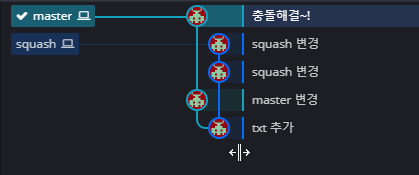

## 주요 옵션
`—no-commit`: 일단 병합을 한다음에 병합에 실패한 것으로 가정후 커밋은 하지 않습니다. (커밋되지 않은 코드를 스테이지에만 올려놓고 코드를 마지막으로 점검하거나, 리뷰 할 때 쓸만함 )

`—no-ff`: fast-forward 되어질 병합 형태라도 반드시 머지 커밋을 만들어서 병합합니다.

`—squash`: 현재 브랜치 위에 단일 커밋을 만들어서 브랜치 병합합니다. ( 커밋 합치기 )
## git merge —no-commit —noff를 활용해서 수정된 코드 살펴보기
```bash
git merge ${commit-hash} --no-commit --no-ff
```
위 명령으로 fast-forward(빨리감기) 하지않고, 일단 커밋하지 않은 상태에서 수정된 코드를 살펴볼 수 있습니다.

## git merge —squash를 활용해서 커밋내역 합쳐보기

설정된 커밋내역에는 다음과 같이 master, squash 두 브랜치가 있습니다.


squash 브랜치를 master에 병합시키고자 하는데, squash 브랜치의 커밋내역들을 합쳐서 병합하고 싶습니다.

`—squash` 옵션으로 병합할 때 스쿼시(커밋내역 합치기)를 할 수 있습니다.
```bash
git checkout master
git merge --squash
```
그러면 다음과 같이 충돌이 발생합니다.


코드를 수정하여 충돌을 잡아주면 깔끔하게 하나의 커밋으로 합쳐졌습니다!

