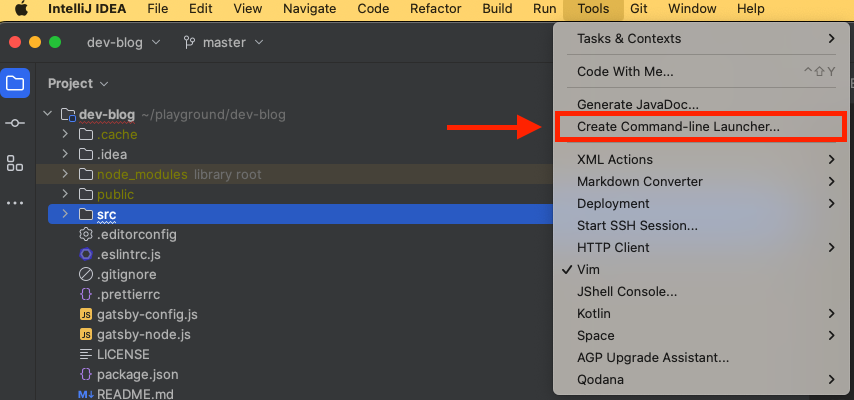
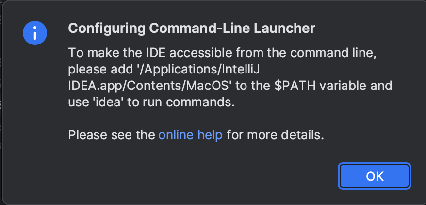

이 포스팅에서는 MacOS M1, M2 칩셋 버전 IntelliJ 에서 Command Line Launcher 설정이 잘 되지 않는 현상을 해결하는 이야기를 다룹니다. 

# 문제 발생 idea 명령으로 IntelliJ 실행이 안되네..?

개발자라면 (특히 Java 개발자) 한번쯤 사용하는 IntelliJ IDEA

IntelliJ는 Command Line Launcher라는 기능을 제공하는데요

_IntelliJ Command Line Launcher란? `idea` 명령으로 IntelliJ를 빠르게 실행할 수 있게 명령어 등록을 도와주는 기능입니다._

설정도 매우 간단하여 IntelliJ 내에서 클릭 두번으로 설정할 수 있습니다. (아래 이미지처럼!)


\
근데.. 잘 안됩니다.


\
팝업 문구에는 해당 경로 환경변수를 추가해주면 된다고 하는데, 추가해주어도 안됌..

# 해결

해결 방법은 간단한데요!

역시 문제가 생길땐 공식문서를 참고해야 한다는것을 다시 한번 느끼게 되었습니다.

[JetBrains Launcher for a standalone instance](https://www.jetbrains.com/help/idea/working-with-the-ide-features-from-command-line.html#standalone) 부분을 참고해보니 몇가지 방식을 알려주는데, 저는 idea binary 명령을 만드는 방법으로 해결했습니다.

## idea 명령 binary로 만들기
/usr/local/bin 디렉토리에 idea 파일을 다음과 같이 작성해줍니다.

_/usr/local/bin/idea 파일 내용_
```bash
#!/bin/sh

open -na "IntelliJ IDEA.app" --args "$@"
```
_혹시 local 디렉토리 하위에 bin 디렉토리가 없다면 bin 디렉토리부터 생성합니다_

## idea 명령 실행 권한 설정
명령이 가능한 binary를 만들어주었으니, 실행 권한을 주도록 합니다.

```bash
sudo chmod +x idea
```

## idea 명령 실행 확인
```bash
idea {IntelliJ로 open 할 project 경로 혹은 파일}
```
