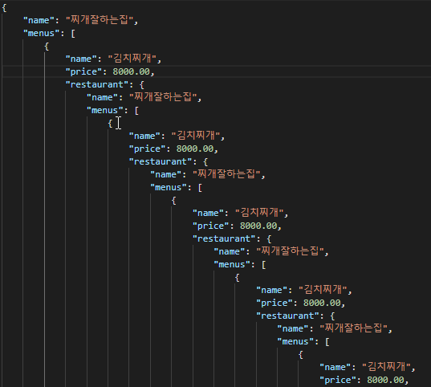
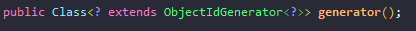
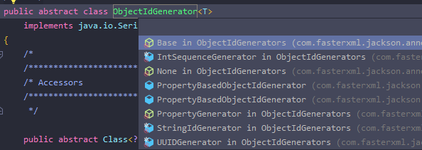
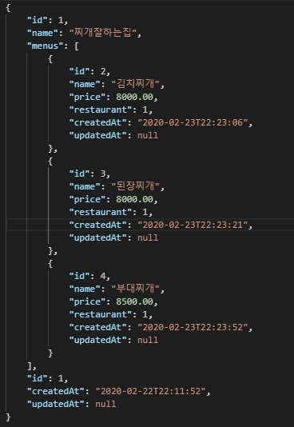

JPA ORM으로 개발하다보면 꽤나 많은 양방향 참조가 필요한 모델들이 있습니다. 그런데 문제는 이런 양방향관계를 가진 객체를 직렬화 하려고 할 때 무한참조가 되어 StackOverFlow를 발생시키는데요. 그렇다고 해서 ORM이 가진 장점을 포기하고 단방향으로만 구성 할 수는 없을겁니다. 

이번엔 양방향 참조를 가짐에도 불구하고 직렬화를 해결하는 해결 법을 살펴보겠습니다.

먼저 이 문제에 대한 해결방법은 다음과 같다고 볼 수 있습니다.

1. Entity로 반환하지 않고, DTO를 적극 활용
2. Json으로 직렬화 할 속성에서 무시 해버리기 (`@JsonIgnore`)
3. 직렬화할 대상 객체의 toString override하여 재정의하기
4. `@JsonManagedReference`, `@JsonBackReference` 어노테이션으로, 직렬화 방향을 설정을 통해 해결
5. <span style="color:skyblue;">**`@JsonIdentityInfo`을 통해 순환참조될 대상의 식별키로 구분해 더이상 순환참조되지 않게 하기**</span>

저는 **5번째** 방식인 `@JsonIdentityInfo`를 통해 해결 해보겠습니다. 참고로 이 방식은 `Jackson 2.0` 이상부터 사용가능합니다.

먼저 해결하기 전 무한 순환참조 된 JSON을 살펴보겠습니다.



계속해서 서로를 참조하며 깊이 파고들어가고 있습니다. 빨리 해결 해야겠습니다.

먼저 양방향 관계의 엔티티에 어노테이션을 달아줍니다.

```kotlin
@Entity
@JsonIdentityInfo(generator = IntSequenceGenerator::class, property = "id") // 추가
class Menu(
        var name: String = "",
        var price: BigDecimal = BigDecimal.ZERO,
        @ManyToOne(fetch = FetchType.LAZY)
        @JoinColumn(name = "restaurant_id")
        var restaurant: Restaurant
): MutableEntity()
```
<br/><br/>
```kotlin
@Entity
@JsonIdentityInfo(generator = IntSequenceGenerator::class, property = "id") // 추가
class Restaurant(
        var name: String = "",
        @OneToMany(mappedBy = "restaurant")
        @OrderBy("name asc")
        var menus: MutableSet<Menu> = TreeSet()
): MutableEntity() {

        internal fun addMenu(menu: Menu) {
                menus.add(menu)
                menu.restaurant = this
        }
}
```
<br/>

`@JsonIdentityInfo` generator 속성에 들어갈 수 있는 객체의 타입은 `ObjectIdGenerator`를 상속받고 있는 서브클래스입니다.





보시는 것처럼 Property를 설정할 수 있는 `PropertyGenrator` , 

숫자형 ID로 설정하는 `IntSequenceGenerator`, 문자열 ID로 설정하는 `StringIdGenerator` UUID 형태의 ID로 설정하는 `UUIDGenerator` 등이 있습니다.

저는 현재 숫자형 ID로 모든 엔티티가 이루어져 있어, IntSequenceGenerator 사용하고, 

property 명을 따로 명시하지 않으면 기본값 직렬화 시 객체의 id가 `@id` 로 설정되기 때문에 저는 property명을 명시해주었습니다.

변경 후 테스트 결과는?



변경하기 전 처럼 서로 순환참조되지 않고, 

정상적으로 한번 직렬화 된 객체는 id값으로만 직렬화 되어지고 있습니다!

# 참고

> 양방향 참조 객체 직렬화 해결하기 [https://www.baeldung.com/jackson-bidirectional-relationships-and-infinite-recursion](https://www.baeldung.com/jackson-bidirectional-relationships-and-infinite-recursion)