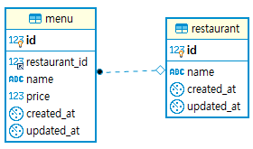
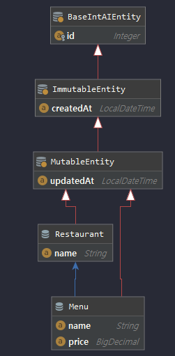
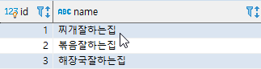
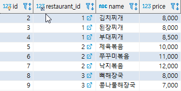
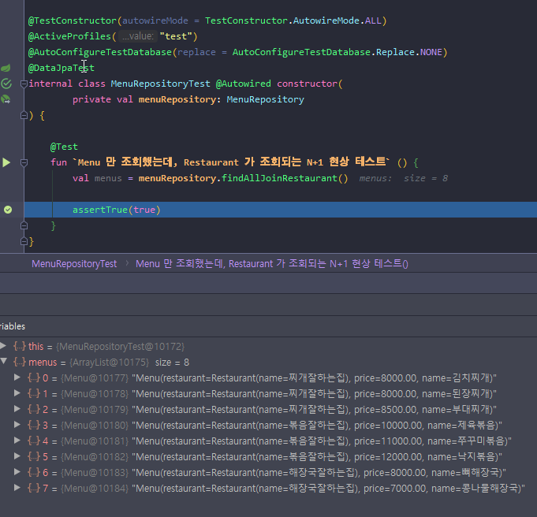
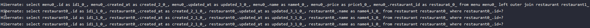
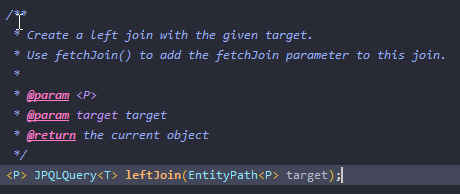
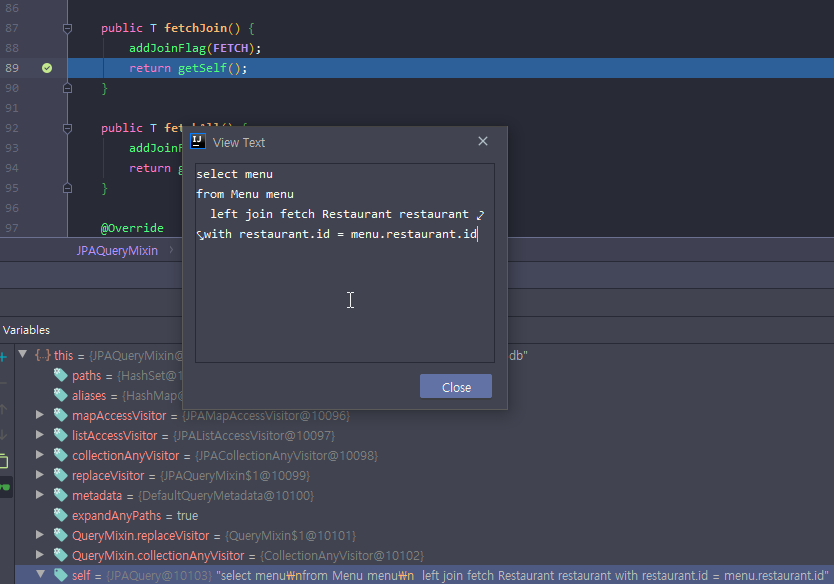
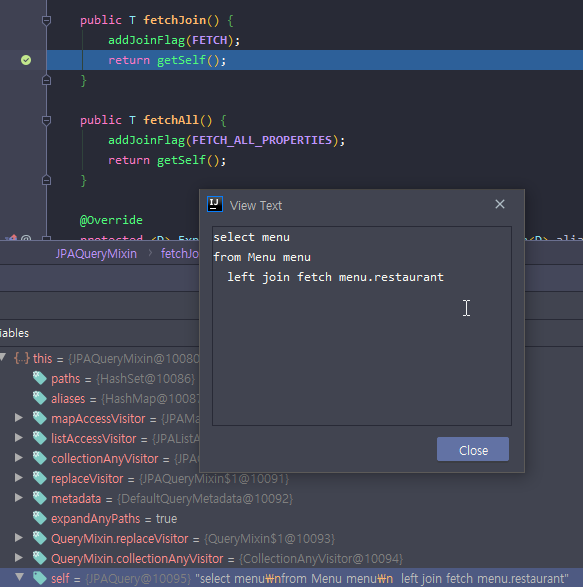
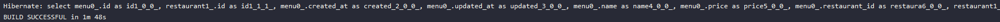

# JPA N+1현상 querydsl fetchJoin 삽질한 경험 공유
- Kotlin
- SpringBoot(2.2.4)
- querydsl(4.2.1)

<br/>

# 문제

JPA로 쿼리를 하다보면, N + 1 문제를 마주하게 될 수도 있는데요.

사실 저의 문제는 정확하게 말하면 N+1 문제는 아닙니다. N+1이란 
@OneToMany의 관계에서 One에 해당하는 엔티티를 조회하면 Many의 해당하는 엔티티가 지연로딩 되어 그 갯수만큼 더 조회한다고 하여 One+N(Many) N+1현상이라고 하는데 저의 경우엔 @ManyToOne의 조회인데도 One에 해당하는
엔티티가 영속성 컨텍스트에 존재하지 않으면 쿼리하게 되는 현상입니다.

저는 보통  `@Query` 어노테이션에 JPQL 쿼리를 작성해서 해결하곤 했었습니다.

근데 querydsl에도 fetchJoin이 있다는걸 최근(?)에서야 알고 사용해보려고 하는데 문제가 해결이 되지 않았습니다. 그 이유는.. 참 어처구니가 없었는데요 혹시나 이런 경우를 겪고 있는 분이 계실까 해서 공유차 포스팅합니다.

이유는 저처럼 join 함수를 잘못 이해하고 사용하면 매개변수 타입에 따라 fetchJoin 함수를 호출하여도 N + 1 문제가 해결이 안될수도 있다는 것인데요 ㅋㅋ


# 예제 구성

먼저 상황을 설명하기 위해 

제가 구성한 예제 구성은 다음과 같습니다. 

`Restaurant(식당)`과 `Menu(식당의 메뉴)`를 표현하는 다음과 같은 ERD와 엔티티가 있습니다.

## 데이터베이스 ERD



## 엔티티 ERD



## Restaurant 엔티티 코드
```kotlin
@Entity
data class Restaurant(
        var name: String = ""
): MutableEntity()
```

## Menu 엔티티 코드
```kotlin
@Entity
data class Menu(
        @ManyToOne
        var restaurant: Restaurant,
        var price: BigDecimal = BigDecimal.ZERO,
        var name: String = ""
): MutableEntity()
```

## 데이터




## 문제의 코드

문제의 코드 입니다. (어떤게 문제인지 바로 아시겠나요?)
```kotlin
class MenuRepositoryCustomImpl: MenuRepositoryCustom, QuerydslRepositorySupport(Menu::class.java) {
    override fun findAllJoinRestaurant(): MutableList<Menu> {
        val m = QMenu.menu
        val r = QRestaurant.restaurant
        return from(m)
                .leftJoin(r)
                .on(r.id.eq(m.restaurant.id))
                .fetchJoin()
                .fetch()
    }
}
```

함수 호출을 위해 테스트코드를 작성하고 실행했습니다. 
( 테스트의 결과값 보다는 N+1 쿼리가 수행되는 것을 보기 위함이므로 일단 테스트는 통과하게끔 했습니다. )
```kotlin
@Test
fun `Menu 만 조회했는데, Restaurant 가 조회되는 N+1 현상 테스트` () {
    val menus = menuRepository.findAllJoinRestaurant()

    assertTrue(true)
}
```




해당 함수를 호출해서 query하면!? N + 1현상이 발생합니다.

첫번째 쿼리인 menu left outer join restaurant 를 했는데도 불구하고, 밑에 세개의 추가 쿼리가 실행되었습니다.


왜 이럴까? 하고 querydsl의 `leftJoin` 함수가 정의된 `JPQLQuery` 인터페이스를 추적 해보았습니다.



언뜻 보기에 함수의 주석 설명에는

- 주어진 target 매개변수를 기반으로 left join이 생성되어 질 것이고,

- fetchJoin을 사용하기 위해서는 fetchJoin 파라미터를 해당 join 에 추가 (**정확하게는 파라미터로 이해하기보다는, fetch join 할 join 함수 뒤에 fetchJoin 함수를 추가해주면 됩니다.**)

하라고 되어있습니다. 이렇게만 보면 제 코드에서 `leftJoin` 함수에 매개변수로 넘겨준 target이 restaurant이니 맞는 것 같기도 합니다만 현재 문제에서 안되는 이유를 찾기 위해 코드를 추적하다 querydsl fetchJoin은 다음과 같이 동작하여 JPQLQuery를 생성한다는 것을 알게되었습니다.



디버그 된 변수를 살펴보시면 `self`에 `JPQLQuery`가 텍스트 로 표현되고 있습니다. 

가만살펴보니 뭔가 이상합니다. 흠 네.. 지금껏 멍청하게 target을 잘못 전달하고 있었던 것이었습니다.


fetch Join이 되려면 

타겟이 restaurant가 아닌 menu의 프로퍼티로 존재하는 menu.restaurant가 되어야 하는것이었습니다.

\
그래서 코드를 다음과 같이 수정하고 해결하였습니다!

## 수정된 코드
```kotlin
class MenuRepositoryCustomImpl: MenuRepositoryCustom, QuerydslRepositorySupport(Menu::class.java) {
    override fun findAllJoinRestaurant(): MutableList<Menu> {
        val m = QMenu.menu
        val r = QRestaurant.restaurant
        return from(m)
                //.leftJoin(r)
                .leftJoin(m.restaurant)
                //.on(r.id.eq(m.restaurant.id)) entity 연관관계 기반으로 어차피 맵핑되서 join함 on 조건을 주면 fetch 할 때 with 에 property를 에
                .fetchJoin()
                .fetch()
    }
}
```

## 수정 후 쿼리



N + 1이 해결 되고 join 쿼리 한번만 수행 되었습니다.

