최근 스프링부트를 개발 할 때 Kotlin으로 많이 개발하고 있는데요,

특히나 이 포스팅에서는, JPA Entity 모델링 을 할 때 주의해야 할 점들을 살펴보겠습니다.

# Entity 모델링

먼저 코틀린에서 Entity 클래스를 작성할 때는 `data class` 로 선언 하는 것보다는 일반 클래스로 선언하는 것이 좋습니다. 그 이유는, `data class` 는 `open` 혹은 `abstract`와 같은 키워드를 허용할 수 없으므로 다른 클래스의 부모클래스가 될 수 없기 때문입니다.  그래서 자바에서는 클래스 구분이 없어 신경쓰지 않았던 상속성을 가져가기 위함과, 연관되어있는 다른 Entity가 있다면 지연로딩을 위해서라도 일반 `class`로 선언 후 `open` 키워드를 붙여주어야 합니다.

1.  JPA에서 지향하는 Entity 객체는 Entity끼리도 상속성을 이룰 수 있어야 합니다.
2. 지연로딩 시 데이터 클래스에서 작동하지 않는 문제

<br/><br/>

## Entity가 되기 위한 클래스 표준 (Entity POJO Model)

### JPA에서 말하는 Entity POJO Model이란? (JPA는 그저 java에서 정의한 ORM 표준)

1. Entity는 final 클래스이면 안된다. ( 메소드나, 인스턴스 변수 또한 마찬가지 )
2. Entity는 최상위 클래스여야 한다.
3. Entity는 추상클래스, 구체클래스 모두 될 수 있다. (Entity는 Entity class뿐만 아니라 Entity가 아닌 class도 확장 할 수 있으며 Entity가 아닌 class는 Entity class를 확장 할 수 있습니다.)
4. Entity는 public 또는 protected 접근제한자를 가진 인수없는 생성자(no-arg) 가 있어야 한다. (추가적으로 생성자를 정의 할 수도 있음)
5. Enum 또는 interface는 Entity가 될 수 없다.

### Hibernate에서 말하는 Entity Model이란? (Hibernate는 JPA의 실질적인 구현체)

1. Entity는 public 또는 protected 접근제한자를 가진 인수없는 생성자(no-arg) 가 있어야 한다. (추가적으로 생성자를 정의 할 수도 있음)
2. Entity는 최상위 클래스 일 필요는 없다.
3. 기술적으로 hibernate는  영속 클래스 혹은 비영속 클래스 상태의 접근 방법(getter, setter 메소드)을 사용하여 최종 영속상태에 접근할 수 있다. 
그러나 이것은 Hibernate가 Entity의 lazy loading을 위한 프록시를 생성할 수 없게 하므로 일반적으로는 좋지 않다. **즉 하이버네이트에서는 final 클래스가 아닌 클래스를 선호한다! 왜? 영속 상태를 관리하기 위해 proxy를 사용하고, lazy loading을 proxy 객체로 처리해야 하기 때문에**

위와 같이 Entity 클래스가 되기 위해 권장되는 규칙이 꽤나 있는데, 저런 규칙을 지키지 않으면 어떤 문제를 일으키는지 코드로 살펴보겠습니다.

다음과 같은 양방향성을 가진 두 엔티티가 있습니다. ( 최근 연습중인 도메인 모델이 식당입니다. ㅋㅋ)

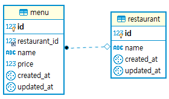

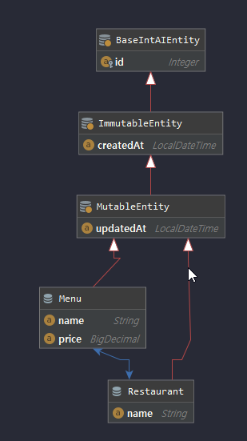

<br/><br/>
```kotlin
@Entity
data class Restaurant(
        var name: String = "",
        @OneToMany(mappedBy = "restaurant")
        @OrderBy("name asc")
        var menus: MutableSet<Menu> = TreeSet()
): MutableEntity() {

        fun addMenu(menu: Menu) {
                menus.add(menu)
                menu.restaurant = this
        }
}

@Entity
data class Menu(
        var name: String = "",
        var price: BigDecimal = BigDecimal.ZERO,
        @ManyToOne(fetch = FetchType.LAZY)
        @JoinColumn(name = "restaurant_id")
        var restaurant: Restaurant
): MutableEntity()
```

보시는 것과 같이 두 엔티티는 `@OneToMany`, `@ManyToOne` 으로 양방향을 가지고 있고, `LAZY fetch` 되게 되어있습니다. (`@OneToMany`에서 fetch 는 default가 LAZY 방식이므로 생략 하였습니다.)

앞서 말씀드렸다시피 data class는 `open`이나 `abstract`가 될 수 없고 기본적으로 `final`로 선언되어집니다. 위 두 클래스를 자바 코드로 변형해보면 다음과 같습니다.

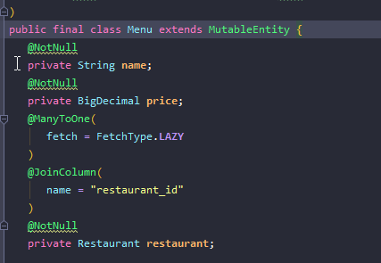
<br/><br/>
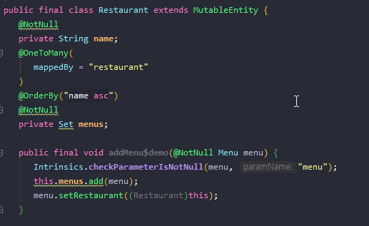

위 코드는 IntelliJ에서 kotlin → kotlin bytecode → decompile java code 한 결과라서 가독성은 떨어집니다.

이제 간단한 repository test를 통해 Menu Entity를 조회 하고 Restaurant Entity를 지연로딩 해보겠습니다.

**코드**

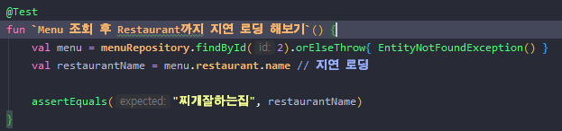
<br/><br/>
**결과**

정상적으로 초록막대와 함께 query 로그도 한번만 찍힌 것을 확인했습니다. 

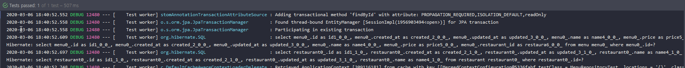

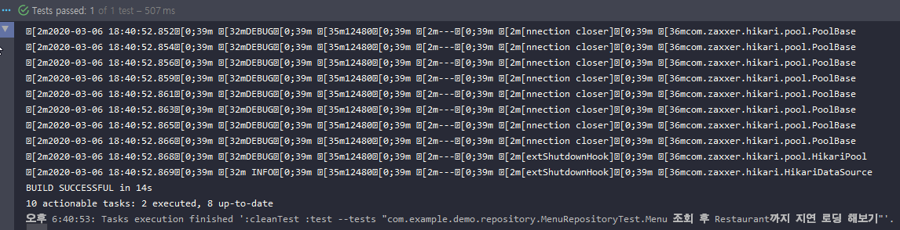

그럼 정말로 문제 없는걸까요? 더 확실히 테스트해보기 위해 직렬화가 필요한 controller 테스트를 해보았습니다. ( 이 테스트는 service를 mocking하는 단위테스트로 작성하지 않고, 실질적인 테스트가 필요하여, 통합테스트로 진행했습니다. )

**코드**

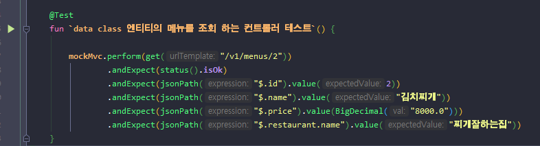
<br/><br/>
**결과**

테스트의 결과는 초록막대인데.. 찍힌 로그가 뭔가 이상합니다

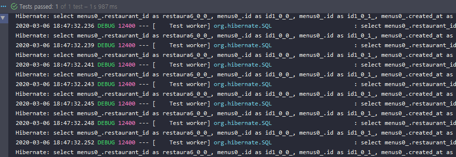

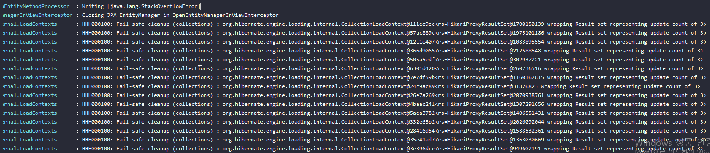

객체를 직렬화 하기전까지는 서로 참조하는 값을 계속해서 참조 할 일이 없지만, 직렬화를 하기 위해 참조하는 과정에서 뭔가 하이버네이트 엔진이 HIkariProxyResultSet으로 부터 결과 값을 가져오는데 무한적으로 재귀호출을 하는 것 같습니다. ( 개발환경에서 허용된 메모리만큼 재귀호출이 되다가 결국엔 StackOverFlow가 발생합니다. 내부적으로 예외처리가 되있어 직접적으로 에러로 표시되진 않는 것 같습니다. )

로그를 자세히 보시면 HikariProxyResultSet의 HashCode가 계속해서 바뀌고, 계속해서 새로운 객체를 참조하여 DB 데이터의 결과값을 가져오려고 시도합니다.

이 문제를 해결하기 위해 제가 시도한 방법은 다음과 같습니다.

- `data class` 를 `일반 class` 로 변경 후 `Hibernate`가 `Lazy load 객체`를 가져올 때 정상적으로 작동 할 수 있게 open 키워드 달아주어 상속 가능하게 만들기
- 직렬화 시 무한 재귀에 빠지지 않게 하기 위해 `HibernateModule`을 빈으로 등록하여 jackson에configuration 하기

### Data class → class 로 변경 후 open 키워드 달기

먼저 data class를 일반 class로 바꾸기
```kotlin
@Entity
class Menu(
        var name: String = "",
        var price: BigDecimal = BigDecimal.ZERO,
        @ManyToOne(fetch = FetchType.LAZY)
        @JoinColumn(name = "restaurant_id")
        var restaurant: Restaurant
): MutableEntity()

@Entity
class Restaurant(
        var name: String = "",
        @OneToMany(mappedBy = "restaurant")
        @OrderBy("name asc")
        var menus: MutableSet<Menu> = TreeSet()
): MutableEntity() {

        internal fun addMenu(menu: Menu) {
                menus.add(menu)
                menu.restaurant = this
        }
}
```

아까 위에서 소개해드렸던 JPA 표준 POJO Model 객체가 되기 위해 

일일이 entity 마다 open 키워드와 빈 생성자를 작성하긴 귀찮으니,  kotlin jpa plugin 을 사용하여 자동적으로 모든 entity에 적용 시켜주겠습니다.

적용하는 방법은 `build.gradle`(groovy dsl) 혹은 `build.gradle.kts` (kotlin dsl) 에서 설정 할 수 있습니다. 

저는 kotlin dsl을 사용하고 있으므로 다음과 같이 작성했습니다.

*build.grade.kts*
```kotlin
plugins {
        ...
    kotlin("plugin.jpa") version "1.3.61"
}

noArg {
    annotation("javax.persistence.Entity")
    annotation("javax.persistence.MappedSuperclass")
    annotation("javax.persistence.Embeddable")
}
allOpen {
    annotation("javax.persistence.Entity")
    annotation("javax.persistence.MappedSuperclass")
    annotation("javax.persistence.Embeddable")
}
```

위와 같이 작성하고 나면 `Entity`, `MappedSuperclass`, `Embeddable` 의 어노테이션이 붙은 클래스에 빈 생성자와 open 키워드가 자동으로 정의됩니다.

`open` 키워드를 코드에서 정의하지 않았는데도, 자바로 변환한 코드에서는 원래의 `final class` 에서 `일반 class` 로 변경되었습니다.

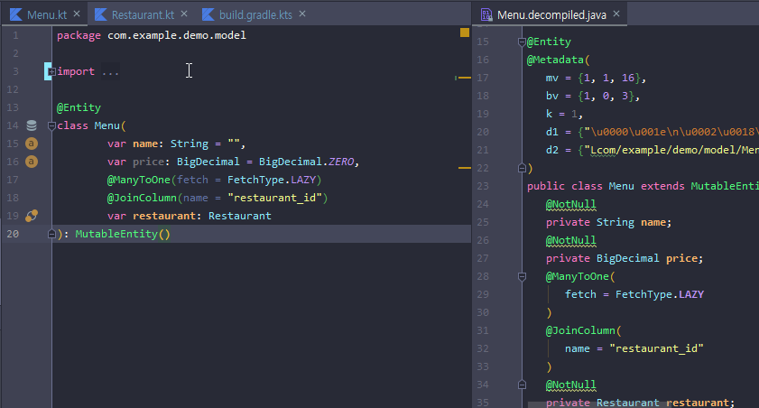

 

### Jackson configuration

아직 lazy 로드 되기 전의 proxy 객체 또한 직렬화 하려고 하면 에러가 나기 때문에 다음과 같은 솔루션으로 직렬화 시 문제를 해결합니다. ( lazy 로드 되기 전의 proxy 객체는 null 처리 해줌 )

저는 hibernate5 버전을 사용하고 있으므로 다음과 같이 작성 했습니다.

*build.gradle.kts*
```kotlin
dependencies {
    ...
    // Hibernate5Module이 지연로딩 되는 객체의 프로퍼티 직렬화를 가능하게 해준다. (jackson ObjectMapper support)
    implementation("com.fasterxml.jackson.datatype:jackson-datatype-hibernate5:2.9.8")
}
```

*JacksonConfig.kt*
```kotlin
@Configuration
class JacksonConfig {

    @Bean
    fun hibernate5Module(): Hibernate5Module {
        // Hibernate5Module이 지연로딩 되는 객체의 프로퍼티 값이 비어있더라도 직렬화를 가능하게 해준다.
        // 이 모듈을 bean으로 등록 안하면 hibernateLazyInitializer 라는 하이버네이트 프록시 객체의 프로퍼티를 직렬화 하려다가 에러남
        return Hibernate5Module()
    }
}
```

위 처럼 변경해준 뒤 다시 테스트를 돌려보면

정상적으로 테스트 통과 후 한번만 쿼리하는 것을 볼 수 있습니다

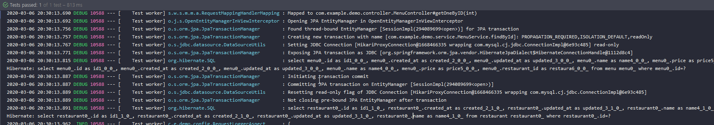
<br/><br/>
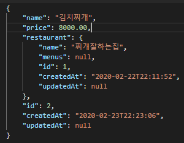

실제로 데이터가 조회되었고, lazy fetch 모드로 설정되있고, 아직 꺼내지 않은 객체 restaurant.menus에 대해서는 null 처리가 되어있습니다. 

하지만 여기서 끝이 아닙니다. 현재까지는양방향관계에서  `@ManyToOne` 를 가진 쪽의 엔티티 조회에서 문제를 해결했는데요, 

아직 `@OneToMany`의 관계를 가진 엔티티를 lazy load 조회 할 때 문제가 있습니다. 

이 부분까지 해결하기 위해서는 여러가지의 솔루션이 있는데 그 중 하나를 다음 포스팅에서 소개하겠습니다.
 [JPA 양방향 관계 무한재귀 해결 포스팅 보러가기](https://thxwelchs.github.io/JPA%20%EC%96%91%EB%B0%A9%ED%96%A5%20Entity%20%EB%AC%B4%ED%95%9C%20%EC%9E%AC%EA%B7%80%20%EB%AC%B8%EC%A0%9C%20%ED%95%B4%EA%B2%B0/)

감사합니다.

# 참고

> 하이버네이트 공식 엔티티 모델링 가이드 [https://docs.jboss.org/hibernate/orm/5.4/userguide/html_single/Hibernate_User_Guide.html#entity](https://docs.jboss.org/hibernate/orm/5.4/userguide/html_single/Hibernate_User_Guide.html#entity)
kotlin compiler-plugins(no-arg, all-open) [https://kotlinlang.org/docs/reference/compiler-plugins.html](https://kotlinlang.org/docs/reference/compiler-plugins.html)
코틀린 JPA [https://github.com/spring-guides/tut-spring-boot-kotlin#persistence-with-jpa](https://github.com/spring-guides/tut-spring-boot-kotlin#persistence-with-jpa)
객체지향적 상속성 활용한 엔티티 설계하기 [https://victorydntmd.tistory.com/209](https://victorydntmd.tistory.com/209)