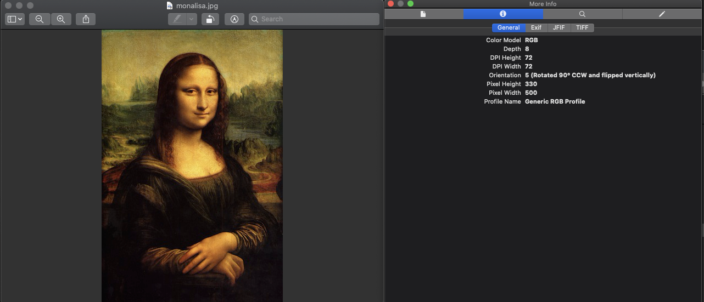

# Exif?

디지털 카메라 등에서 사용되는 이미지 파일 메타데이터 포맷으로, 카메라가 촬영한 사진, 녹음파일에 시간 등의 각종 정보를 담기 위해 개발되었다. 즉, JPEG, TIFF 6.0과 RIFF, WAV 포맷에 이미지나 소리에 대한 정보를 추가로 기록할 수 있다

특히 Exif 메타데이터 정보 중 Orientation 값은 사진의 회전 정보를 담고 있는데, 카메라 디바이스 의 중력 센서 기반을 활용한 회전 정보가 이미지 파일 Exif 태그 중 하나에 기록됩니다.

Orientation은 정수 1~8 사이의 값으로 저장 되고, 이 값의 의미가 각도를 뜻하는 것은 아닙니다.

일정한 규칙이 있긴 하나, 프로토콜 처럼 정확히 약속된 것은 아닌 것 같습니다. 일단은
이 규칙에 따라 변환 시켜야 합니다.

다음과 같이 Mac의 Preview로 Exit의 방향(Orientation 값을 볼 수 있습니다.) 사실상 이 사진은 반시계 방향으로 90도 회전 되어 있어야 맞는건데, Mac의 Preview가 orientation 값을 읽어 보기 좋게 보여주는 것 같습니다.



ExifIFD0 은 Exif Data 헤더 중 하나의 영역입니다.

자바 군에서는 metadata-extractor 라이브러리가 범용적이며, 다음과 같은 클래스를 제공합니다.
```java
    /*
     * Copyright 2002-2019 Drew Noakes and contributors
     *
     *    Licensed under the Apache License, Version 2.0 (the "License");
     *    you may not use this file except in compliance with the License.
     *    You may obtain a copy of the License at
     *
     *        http://www.apache.org/licenses/LICENSE-2.0
     *
     *    Unless required by applicable law or agreed to in writing, software
     *    distributed under the License is distributed on an "AS IS" BASIS,
     *    WITHOUT WARRANTIES OR CONDITIONS OF ANY KIND, either express or implied.
     *    See the License for the specific language governing permissions and
     *    limitations under the License.
     *
     * More information about this project is available at:
     *
     *    https://drewnoakes.com/code/exif/
     *    https://github.com/drewnoakes/metadata-extractor
     */
    
    package com.drew.metadata.exif;
    
    import com.drew.lang.annotations.NotNull;
    
    import java.util.HashMap;
    
    /**
     * Describes Exif tags from the IFD0 directory.
     *
     * @author Drew Noakes https://drewnoakes.com
     */
    @SuppressWarnings("WeakerAccess")
    public class ExifIFD0Directory extends ExifDirectoryBase
    {
        /** This tag is a pointer to the Exif SubIFD. */
        public static final int TAG_EXIF_SUB_IFD_OFFSET = 0x8769;
    
        /** This tag is a pointer to the Exif GPS IFD. */
        public static final int TAG_GPS_INFO_OFFSET = 0x8825;
    
        public ExifIFD0Directory()
        {
            this.setDescriptor(new ExifIFD0Descriptor(this));
        }
    
        @NotNull
        private static final HashMap<Integer, String> _tagNameMap = new HashMap<Integer, String>();
    
        static
        {
            addExifTagNames(_tagNameMap);
        }
    
        @Override
        @NotNull
        public String getName()
        {
            return "Exif IFD0";
        }
    
        @Override
        @NotNull
        protected HashMap<Integer, String> getTagNameMap()
        {
            return _tagNameMap;
        }
    }
```

## Spock 테스트 코드

```groovy
def "이미지 메타데이터 읽어서 회전시켜 저장하기 테스트"() {
        given:
                // 이미지 부터 mocking ( 애플리케이션 내부 경로에 모나리자 이미지를 넣어놓은 상태입니다.
        def originFileName = "monalisa.jpg"
        def file = new FileInputStream("sampledata/" + originFileName)
        def fileExt = FilenameUtils.getExtension(originFileName)
        def multipartFile = new MockMultipartFile("imageFile", originFileName, fileExt, file)

                // Exif Header에는 여러 영역의 엔트리 들로 나뉘어져 있는데 그 중 내가 원하는 정보는 Exif IFD0 에 있으므로
                // ExifIFD0Directory 클래스 타입을 이용한 metadata 를 얻어낸다.
        def metadata = ImageMetadataReader.readMetadata(multipartFile.getInputStream())
        def dir = metadata.getFirstDirectoryOfType(ExifIFD0Directory.class)
        def orientatation = dir.getInt(ExifIFD0Directory.TAG_ORIENTATION)
        def img = ImageIO.read(multipartFile.getInputStream())
        def width = img.getWidth()
        def height = img.getHeight()
        
                // orientation 값에 의한 아핀 변환 ( 아핀변환은 기회가 되면 다음 포스팅 때 작성해보겠습니다.)
                def tf = new AffineTransform()
        switch (orientatation) {
            case 1:
                break;
            case 2:
                tf.scale(-1.0, 1.0)
                tf.translate(-width , 0)
                break;
            case 3: // PI rotation
                tf.translate(width, height)
                tf.rotate(Math.PI)
                break
            case 4: // Flip Y
                tf.scale(1.0, -1.0)
                tf.translate(0, -height)
                break
            case 5: // - PI/2 and Flip X
                tf.rotate(-Math.PI / 2)
                tf.scale(-1.0, 1.0);
                break
            case 6: // -PI/2 and -width
                tf.translate(height, 0)
                tf.rotate(Math.PI / 2)
                break
            case 7: // PI/2 and Flip
                tf.scale(-1.0, 1.0)
                tf.translate(-height, 0)
                tf.translate(0, width)
                tf.rotate( 3 * Math.PI / 2)
                break
            case 8: // PI / 2
                tf.translate(0, width)
                tf.rotate( 3 * Math.PI / 2)
                break
        }
        def uuid = UUID.randomUUID().toString()
        def resizedFile = new File("sampledata/" + uuid + "." + fileExt)
        def affineTransformOp = new AffineTransformOp(tf, AffineTransformOp.TYPE_BILINEAR)
        def destinationImage = new BufferedImage(height, width, img.getType())
        destinationImage = affineTransformOp.filter(img , destinationImage)

        expect:
        ImageIO.write(destinationImage, "jpg", resizedFile)

        orientatation == expectOrientatation

        where:
        expectOrientatation |
        5
```


## 이미지 변환 결과

Mac Preview에서는 오리엔테이션 값에 의해 회전시켜버리기 때문에 online metadata view를 이용했습니다.

원본


변형본


참고

> [https://namu.wiki/w/EXIF](https://namu.wiki/w/EXIF)\
[https://stackoverflow.com/questions/21951892/how-to-determine-and-auto-rotate-images](https://stackoverflow.com/questions/21951892/how-to-determine-and-auto-rotate-images)