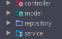
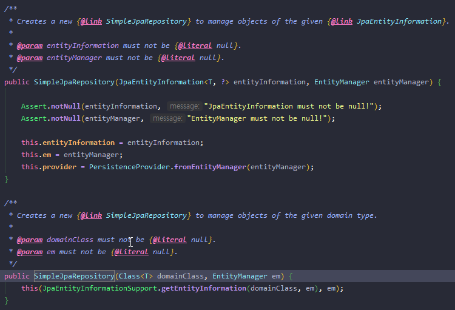
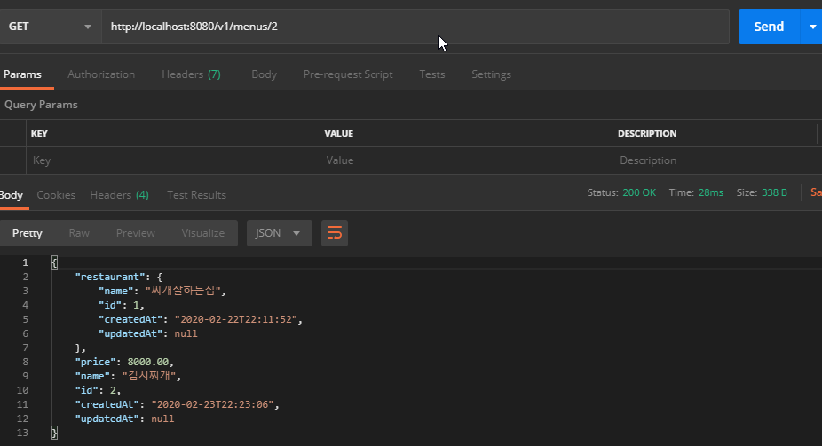
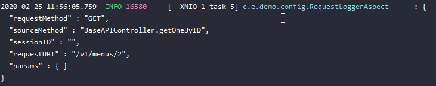

# Spring 다형성, 상속성을 이용한 중복코드 줄여보기

스프링부트를 활용하면 상당 부분 설정이 편리해진 부분이 있었지만, 흔한 MVC 패턴에서(물론 실제 개발은 MVVM 패턴으로 개발중) 엔드포인트 혹은 엔티티가 늘어 날 때마다 반복되는 코드들이 생기는게 불만스러웠습니다. 그래서 고민을 하게 되었습니다.

> 객체지향스럽게(?) 다형성과 상속성을 지키는 구조로 중복되는 코드들을 줄여보는게 어떨까?

# 공통이되 중복되는 부분 제거

먼저 저의 스프링부트 구조에서 중복을 없앨만한 요소들을 찾아 보았습니다.

저의 스프링부트 프로젝트의 모듈구조는 싱글모듈 구조 였고, 

`controller`, `model`(entity), `service`, `repository` 를 주요 레이어로 가지는 구조였기에

`entity`가 늘어나면 늘어난 entity 기반으로 `controller`, `repository`, `service`를 생성해주어야 했습니다.



\
그래서 controller, repository, service의 공통되는 부분을 묶어서 중복을 제거하고자 했습니다.

<br/><br/>

## Service 공통 부분 중복 제거

중복되는 부분은 예를 들어 `service`에서 단순히 `repository`를 통해 처리 한 뒤  `controller`에게 전달해주는 그런 로직들이 대상이 될 것 입니다.  예시 코드입니다. 

```kotlin
@Service
class MenuService(private val menuRepository: MenuRepository) {
        // 이런거.. 일일이 굳이 코드로 작성 할 필요는 없지 않을까?
        fun save(menu: Menu): Menu { 
        return menuRepository.save()
        }

    fun findAll(): MutableList<Menu> {
        return menuRepository.findAll()
    }

        ...
}
```

물론 controller에서 바로 repository를 DI하여 작업을 수행 할 수도 있겠지만
가능하면 `controller` -> `service` -> `repository` | `other service` 의 레이어 형태를 지키는
것이 바람직하지 않을까? 라는 생각 하고 있습니다.
그래서 위 예시코드에 기본적으로 제공되는 메소드들을 굳이 직접 service에 작성하지 않고 호출하는 구조로 만들고 싶어서 다음과 같이 entity를 다루는 service라면 반드시 상속받게 할 BaseEntityService를 생성했습니다.

    
```kotlin
/**
    * Entity 공통 Service
    * Generics description
    * E: Entity, ID: Entity Primary Key (직렬화 할 수 있는 형태의 자료 형태)
    *
    * SimpleJpaRepository는 JpaRepository의 실질적인 구현체 클래스입니다.
    * SimpleJpaRepository를 상속받기 위해선 반드시 super생성자로 클래스를 초기화 해주어야 하는 것 같은데,
    * 그 super 생성자는 찾아보니 두개의 생성자로 오버로딩 되어 있고, 저는 그 중 하나인 
    * entity의 클래스 타입과, entityManager를 받는 생성자로 슈퍼클래스 상속받게 했습니다.
    */
abstract class BaseEntityService<E : Any, ID : Serializable?>(
        clazz: KClass<E>,
        entityManager: EntityManager) : SimpleJpaRepository<E, ID>(clazz.java, entityManager) {
}
```

저는 JpaRepository가 어떤 구현체로 이루어져있는지 관심도 없었는데 이번에 처음 관심 갖게 되었고, 살펴보게 되었습니다. 

다음과 같이 두가지 생성자가 있는데 저는 두번째 타입의 생성자를 통해 상속하고 있습니다.



그럼 `BaseEntityService`가 완성되었으니 사용하게 될 Service에서 상속만 하면 되겠죠? 

그 구조는 다음과 같습니다.

```kotlin
@Service
class MenuService(
        private val menuRepository: MenuRepository,
        private val entityManager: EntityManager
) : BaseEntityService<Menu, Int>(Menu::class, entityManager) {

        // 이런거.. 일일이 굳이 코드로 작성 할 필요는 없지 않을까?
        // BaseEntityService에 이미 구현되어 있으니
        // 이제 이런 JpaRepository에서 정의된 함수들은 없어도 됌
        /*
        fun save(menu: Menu): Menu { 
        return menuRepository.save()
        }

    fun findAll(): MutableList<Menu> {
        return menuRepository.findAll()
    }
        
        ...
        */

    fun findAllJoinRestaurant(): MutableList<Menu> {
        return menuRepository.findAllJoinRestaurant()
    }
}
```

이 서비스는 `Menu` 엔티티의 비즈니스로직을 처리하는 `Service`이고, Entity 타입과, Entity의 기본키가 될 자료타입을 제네릭으로 넘겨주고 Entity의 클래스와 DI 받은 EntityManager를 슈퍼클래스 생성자에 인자로 전달해주는 구조입니다.

위처럼 구조를 갖춘 이유는, 사실 아직 제가 잘 몰라서..ㅋㅋ 도 맞지만

BaseEntityService에서 받을 제네릭타입의 클래스를 런타임에선 얻을 수 없다는 걸 알았습니다.

Spring에서 제공하는 어떤 Util이 있다는 자료를 보긴 했지만, 일단은 포기하고 저렇게 인자로 전달해주는 방식을 선택했습니다.

어쨌든.. 저 형태를 갖추게 되면 MenuService에 직접적인 find, save, delete 등 JpaRepository에 정의되어진 spring data jpa의 기본 메소드들을 사용 할 수 있게 됩니다. 혹시 메소드의 재정의가 필요하다면 override하여 재정의 하면 됩니다.

그 다음은 controller 차례입니다.

<br/><br/>

## Controller 공통 부분 중복 제거

먼저 controller에서 항상 공통이되 중복되는 부분이 어떤걸까요?

주로 `전체조회하기`, `id로 하나 조회하기,` `삭제하기`, `수정하기`, `등록하기` 정도가 될 것 같습니다.

그래서 이것들을 제거하기 위해 다음과 같은 BaseAPIController를 작성했습니다.

저는 Restful 한 구조의 엔드포인트를 관리하는 controller를 생성할 것이기 때문에 `@RestController` 전용 슈퍼클래스를 생성 했습니다.

```kotlin
/**
    * Rest API 공통 컨트롤러
    * Generics description
    * E: Entity, ID: Entity Primary Key (직렬화 할 수 있는 형태의 자료 형태), S: 해당 엔티티의 비즈니스 로직을 처리하기 위한 서비스 클래스 (BaseEntityService를 상속하는 객체 여야 함.)
    */
@RestController
abstract class BaseAPIController<E : Any, ID : Serializable, S : BaseEntityService<E, ID>> {
    @Autowired
    lateinit var service: S

    @GetMapping("/{id}")
    fun getOneByID(@PathVariable id: ID): ResponseEntity<E> {
        return ResponseEntity.ok(service.findById(id).orElseThrow { EntityNotFoundException() })
    }

    @GetMapping
    fun get(): ResponseEntity<MutableList<E>?> {
        return ResponseEntity.ok(service.findAll())
    }

    @PostMapping
    fun create(entity: E): ResponseEntity<E> {
        return ResponseEntity.ok(service.save(entity))
    }

    @PutMapping
    fun update(entity: E): ResponseEntity<E> {
        return ResponseEntity.ok(service.save(entity))
    }

    @DeleteMapping("/{id}")
    fun deleteById(@PathVariable id: ID) {
        service.deleteById(id)
    }

    @DeleteMapping
    fun delete(entity: E) {
        service.delete(entity)
    }
}
```

상속받을 슈퍼클래스를 만들었으니 상속만 하면 슈퍼클래스에서 제공하는 엔드포인트는 모두 코드 작성 없이도 얻을 수 있을 것 같습니다.
```kotlin
@RestController
@RequestMapping("$API_VERSION_PREFIX/menus") // ENDPOINT: localhost:8080/v1/menus
class MenuController(
        private val menuService: MenuService
) : BaseAPIController<Menu, Int, MenuService>() {
        // 여긴 분명.. 비어 있는데?
}
```

다음과 같이 슈퍼클래스에서 제공하는 엔드포인트에 정상적으로 요청하여 응답받아오는 것을 보실 수 있습니다.



음.. 이걸론 뭔가 부족한 것 같아서 덧붙여 AOP로 request 정보를 logging하는 것도 추가해보겠습니다.

## AOP request logger 추가

먼저 저는 Kotlin에서 사용하는 KotlinLogging을 통해 logging을 할거라서 의존성을 하나 추가해주었습니다. java나 기존 slf4j를 사용하실거라면 이 의존성은 필요 없습니다.

그러나 org.springframework.boot:spring-boot-starter-web 에서 제공하는 Aspect를 이용할 것이기 때문에 해당 의존성은 필수입니다. 아마 스프링부트 프로젝트라면 따로 추가하실 필요는 없습니다.

```kotlin
//logging
implementation("io.github.microutils:kotlin-logging:1.7.6")
```

다음과 같이 Aspect logger를 작성해주고 pointcut과 around전략을 세웠습니다.

보시다시피 그냥 request를 받는 controller 메소드들에 한해서 request 정보를 로깅하는 용도입니다.

추후 APM(애플리케이션 성능 관리 툴)같은 것을 활용해서 로깅 추적 같은 것을 할 때 도움이 될 것 같습니다.

```kotlin
@Component
@Aspect
class RequestLoggerAspect {

    private val logger = KotlinLogging.logger{}

    // 해당 패키지 하위에 있는 컨트롤러의 모든 메소드에 적용
    @Pointcut("execution(* com.example.demo..controller.*.*(..))")
    fun requestPointCut() {}

    @Around("requestPointCut()")
    @Throws(Throwable::class)
    fun requestLogger(joinPoint: ProceedingJoinPoint): Any {
        val result = joinPoint.proceed()
        val request = (RequestContextHolder.currentRequestAttributes() as ServletRequestAttributes).request

        // TODO mapper를 빈으로 등록 해버리고 싱글톤 형태로 관리할까?
        val mapper = ObjectMapper()

        val logMap: MutableMap<String, Any> = HashMap()
        logMap["sessionID"] = request.requestedSessionId?: ""
        logMap["requestURI"] = request.requestURI
        logMap["requestMethod"] = request.method
        logMap["sourceMethod"] = joinPoint.signature.declaringType.simpleName + "." + joinPoint.signature.name
        logMap["params"] = request.parameterMap

        logger.info(mapper.writerWithDefaultPrettyPrinter().writeValueAsString(logMap))

        return joinPoint.proceed()
    }
}
```

자, 이제 AOP 적용 후 요청을 해보면?

다음과 같이 로깅됩니다.



<br/><br/>

## Repository 공통 부분 중복 제거

예를 들어 createdAt 컬럼에 인덱스가 있고 범위 조회를 해야 하는 조건과 같은 것이 될 수도 있겠습니다. (`SELECT * FROM entity WHERE createdAt BETWEEN 'YYYY-MM-DD' AND 'YYYY-MM-DD'`) 혹은 2차캐시를 적용하거나 locking이 필요한 경우에도 공통되는 부분들을 이 `BaseEntityRepository`에 정의 후 각각의 엔티티 `Repository`에서 상속받게 하면 중복되는 부분들이 제거 되고 한결 깔끔해진 코드를 볼 수 있을 것 같습니다.

아 이 공통 repository는 상속용 interface이므로 스프링부트 애플리케이션이
처음 로드 되면서 컴포넌트 클래스(Controller, Repository, Component)들을 빈에 등록 할 때 이 인터페이스도 포함하면 안되므로 반드시 `@NoRepositoryBean` 어노테이션을 달아주어야 합니다.
```kotlin
@NoRepositoryBean
interface BaseEntityRepository<T, ID : Serializable?>: JpaRepository<T, ID> {
    fun findByCreatedAtBetween(start: LocalDateTime, end: LocalDateTime): MutableList<T>

    @Query("SELECT t FROM #{#entityName} t WHERE t.id >= :id") // 이런식으로 T로 받은 제네릭을 JPQL에서도 활용 가능합니다.
    fun findByBiggerId(id: ID): MutableList<T>

    @Query("SELECT t FROM #{#entityName} t WHERE t.id = :id")
    @Lock(LockModeType.PESSIMISTIC_WRITE)
    fun findByIdWithExclusiveLock(id: ID): T

    @Query("SELECT t FROM #{#entityName} t WHERE t.id = :id")
    @Lock(LockModeType.PESSIMISTIC_READ)
    fun findByIdWithSharedLock(id: ID): T
}
```

글이 너무 길어져 쓰고보니 많이 장황하네요, 어쨌든 앞으로 이런 중복되는 코드를 제거해가며 확장성 있는 구조가 될 수 있게 하는 연구를 많이 해 봐야겠습니다!

\
코드링크 -> https://github.com/thxwelchs/springboot-starter-with-kotlin