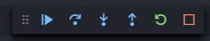

안녕하세요 이번에는 React로 프론트엔드 개발할 때 Visual Studio Code + Debugger for Chrome 를 활용한 디버깅 하는 방법에 대해 알아보겠습니다.

**이미 디버거를 잘 활용하고 계셨던 분이라면 굳이 이 포스팅을 보실 필요는 없으실 것 같습니다.**

**디버깅**은 코드에 브레이크포인트를 지정하여 프로그램 실행을 정지하고, 콜스택 등의 메모리에 저장된 값을 살펴보며, 실행을 재개하거나, 코드를 단계적으로 실행하는 등의 동작을 할 수 있게 해줍니다.

저는 백엔드 개발을 할 때에는 주로 java 혹은 kotlin 언어를 다루기 때문에 IntelliJ를 많이 활용해서 debugger 로 디버깅을 했었지만 

정작 프론트엔드개발을 할 때에는 debugger를 활용한 디버깅은 하지 않았던 것 같습니다...


어쨌든 디버거를 활용 안했던 지난 날을 지워버리고 지금부터라도 활용하는 방법을 알아보겠습니다.

먼저 vscode의 extension을 하나 설치하셔야 하는데요 

vscode 확장 마켓플레이스에 가셔서 Debugger for Chrome을 검색 후 설치해주시면 됩니다.


이 확장프로그램은 특정 포트의 특정 경로에 로드된 JS 코드에 debugger를 listen 시킬 수 있습니다.

설치를 하셨다면, 디버깅할 프론트엔드 프로젝트 루트 경로에 다음과 같은 파일명을 만들고 내용을 작성합니다. 


.vscode/launch.json

```json
{
    "version": "0.2.0",
    "configurations": [
        {
            "type": "chrome",
            "request": "launch",
            "name": "chrome debugger",
            "url": "http://localhost:3000",
            "webRoot": "${workspaceFolder}/src"
        }
    ]
}
```

url에 있는 port는 본인의 프론트엔드 개발 모드로 실행되는 port를 입력해주시면 됩니다. 저는 React 기본 포트인 **3000**으로 설정해주었습니다.

이제 모든 설정은 끝났고 breakpoint 를 걸어 디버깅을 하는 테스트를 해보겠습니다.

먼저 React app 을 `npm` 혹은 `yarn`으로 실행하여 줍니다.

코드는 보시다시피 CRA 로 생성된 리액트 초기 코드인데요 테스트를 위해 임의의 변수를 할당 하고 콘솔에 출력하는 코드를 작성한 뒤 콘솔 출력하는 부분에 브레이크포인트를 걸었습니다.

브레이크포인트는 코드라인넘버 왼쪽에 보이는 틈사이에 커서를 가져다대면 일반적인 테마에서는 빨간 점으로 표시됩니다. 여기서 그냥 왼쪽 클릭을 하게되면 해당 라인에 브레이크 포인트를 걸 수 있습니다. ( 조건 브레이크포인트 등 브레이크포인트를 걸 수 있는 방법은 좀 더 다양합니다. 기회가 되면 다음 포스팅 때 작성해보겠습니다. )


그 다음 debugger를 실행시키기 위해 단축키 `F5` 혹은 vscode 좌측 탭에 보이는 Run and Debug 탭에서 start debugging 버튼을 클릭하셔도 됩니다.

그러면 다음 이미지와 같은 디버거 액션 버튼들이 있는 탭이 화면 중간 상단에 뜨면서 디버거가 실행될 겁니다.



Debug action은 다양한데 좌측부터 차례대로 다음 설명과 같습니다.

- <span style="color:skyblue;">continue</span> \
다음 breakpoint로 이동, 다음 breakpoint가 없을 시 디버깅 종료
- <span style="color:skyblue;">step over</span> \
현재 break 된 파일에서 다음 라인으로 이동
- <span style="color:skyblue;">step into</span> \
break된 라인에서 실행되고 있는 내부 함수로 이동
- <span style="color:skyblue;">step out</span> \
break라인에서 호출한 곳으로 이동합니다.
- <span style="color:skyblue;">restart </span> \
debugger 재실행
- <span style="color:skyblue;">stop</span> \
debugger 종료

Debugger로 실행이 정상적으로 되었다면 브레이크포인트가 존재하므로 프로그램이 해당 부분을 실행할 때 멈추게 될텐데요 디버그 local 변수 탭에 보면 다음과 같이 브레이크포인트 바로 위에서 할당한 message 변수의 값이 할당된 것을 확인해 볼 수 있습니다.


\
그렇다면 조금 코드를 바꿔서 step into와 step over를 활용한 디버깅을 해보겠습니다.

변수 `message` 를 함수의 리턴값으로 할당되게 코드를 조금 변경한 뒤 브레이크포인트를 그대로 `message` 변수 할당 라인에 찍고 디버거를 실행해 보겠습니다.

보시다시피 코드는 함수가 하나 추가되었고 `message` 는 함수의 반환 값으로 할당되게 되었는데요

현재 브레이크포인트에서는 message는 아직 할당되지 않았으니 당연히 `undefined` 입니다.


\


위에서 언급했던 debug action 중 step into action을 활용하면 해당라인의 함수로 들어갈 수 있으니 `이건함수다` 함수로 들어갈 수 있겠죠? step into 해보겠습니다.

\


위 와 같이 브레이크포인트를 찍지도 않았는데 함수안의 return문 라인을 디버깅 하는중입니다.

왼쪽 local 변수값을 살펴보면 매개변수로 넘어온 hello world! 라는 값이 잘 할당되었네요. 여기서 step over을 해보겠습니다. step over는 브레이크 포인트를 찍지 않았어도 다음 라인을 계속해서 디버깅 할 수 있습니다. 여기서는 크게 의미가 없으니 `console.log` 로 출력하고 있는 13번 라인까지 step over해서 이동해보도록 하겠습니다. 


\
위 와 같이 `console.log` 하는 라인에서의 `message` 변수의 값은 정상적으로 함수를 거쳐 `hello world! for chrome ~` 이라는 문자열 값으로 할당된 것을 확인 할 수 있습니다.

이로써 매우 간단한 예를 들어 디버깅을 해보았지만 프로그램의 복잡도가 증가 할 수록 디버깅의 중요성은 매우 높아집니다.

앞으로 디버거를 더 많이 활용하여 프론트엔드 사이드에서도 코드 디버깅시간을 단축시켜줄 수 있을 것 같습니다