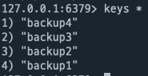

# 사건의 발단

어느날.. redis와 관련된 기능을 개발해야 할 일이 있어 redis를 local에서 docker 컨테이너로 실행 후 테스트를 해보고 있었습니다.

기능은 아주 간단해서 어떤 특정한 상황 때 hash 자료구조로 redis에 key value를 넣으면 되는 것이었는데, 특정한 시간이 지나면 자동으로 해당 key들이 지워질 수 있게 key에 TTL을 지정해주기로 했습니다.

그래서 TTL을 5분정도로 주고 5분이 지나고 제대로 삭제가 되었는지 확인 해보기로 했습니다.

<br/>
<br/>


# redis 설치, 실행

먼저 redis를 로컬에 설치하기 위해 직접 redis-server를 설치해서 실행해도 되지만, 저는 환경의 이식성이나 편리함을 위해 docker를 사용하기로 했습니다.

개발환경에서 컨테이너를 지속적으로 띄웠다 내렸다 할 것이기 때문에 다음과 같이 `bitnami/redis` 이미지를 사용하는 `docker-compose.yml`를 작성했습니다.

> 여러 redis docker image가 있겠지만 저는 bitnami에서 배포하는 이미지를 선호합니다. bitnami는 최신 버그 수정 및 기능에 대해 빠른 피드백과 반영이 이루어지기 때문에 그렇습니다.

```yaml
redis:
    image: 'bitnami/redis:latest'
    environment:
      - ALLOW_EMPTY_PASSWORD=yes # 비밀번호를 생략하고 redis에 접근가능하게 하는 옵션
    ports:
      - '6379:6379'
```

docker-compose 를 실행해주고 redis-cli로 접속해보면?

```bash
docker-compose up -d
```

```bash
redis-cli
```


짜잔 이렇게 간단하게 로컬환경에 레디스를 설치해보고 접속까지 너무 짧은순간에 완성되었습니다.

*(redis에 직접 접근하기 위해서는 redis-cli 혹은 redis client tool 을 사용해야 하는데, 이 부분은 별도의 설치가 필요하니 각자 OS환경에 맞는 설치가 사전에 필요합니다.)*

<br/>
<br/>


# 테스트

### hash 키 저장

다음과 같이 입력하면 hello라는 key에 있는 world라는 필드에 hellowrold라는 문자열을 value로 가지게하는 해쉬 자료구조를 저장하게됩니다.

```bash
hset hello world helloworld
```

### hash 잘 저장되었는지 확인 순서대로

1. hash key 확인
2. hash key 어떤 필드들이 있는지 확인
3. hash field에 어떤 value가 저장되었는지 확인

```bash
keys *
hkeys hello
hget hello world
```


### hash 키에 expire time 지정

TTL 동작여부를 테스트 하기 위해 hash key에 expire 명령을 통해 TTL을 지정해줍니다.

다음과 같이 명령하면 hello라는 키에는 300초의 ttl을 지정해 줄 수 있습니다.

```bash
expire hello 300
```

ttl을 지정해주고 다음과 같이 남아있는 ttl이 있다면? ttl을 반환하게 됩니다.

```bash
ttl hello
```

- ttl이 남아있으면 해당 값을 반환
- expire time이 설정되어있지 않았으면 `-1` 반환
- key가 삭제되었으면 `-2` 반환

저는 5분(300초) 로 지정했고 4초가 지나서 다음과 같이 반환되었습니다.


<br/>
<br/>


# 사라져 버린 key

그리곤 약 1분정도 지났을까요? expire time이 얼마나 남았나 확인을 해보니..


<br/>

....? 

`-2`가 반환되었습니다..

위에서 말씀드렸다시피 `-2`는 key가 삭제되었음을 의미하는데요 어찌된 일일까요?

<br/>
<br/>


# 알 수 없는 key

```bash
keys *
```

key가 정말 삭제되었는지 의심이 되어 key 전체목록을 봐보기로 했습니다.



정작 있어야 할 `hello` key는 없고 아까는 존재하지 않았던 backup1 ~ 4 key가 생겼네요? 

혹시 뭔가.. 잠깐 컨테이너가 내렸다 올라온건가? 내가 받은 `bitnami/redis` 도커이미지가 잘못되었나? 원래 redis에서는 일정 주기마다 백업을 하는 기본전략이 있나? 라는 생각에 redis 공식문서와 bitnami/redis github issues를 뒤져봤지만 해당 내용에 대해서는 찾을 수 없었습니다.

이후로 반복적으로 더 테스트해보았고 다음과 같은 결과를 도출해냈습니다.

- 짧은 시간(1분 이내)이든 긴시간이든 랜덤하게 key가 갑자기 모두 삭제됌 (ttl 적용 여부와 관계없이)

<br/>
<br/>


# redis 모니터링 해보기

그래서 key를 입력한 뒤 갑자기 삭제되기까지 대체 무슨 일들이 일어나는지 더 상세하게 살펴보기 위해 redis를 모니터링 해보기로 했습니다.

모니터링은 다음과 같이 할 수 있습니다. 

```bash
redis-cli monitor
```

위 명령을 통해 redis에 어떤 명령들이 내려졌는지 로그를 확인 할 수 있습니다.

약 5~7분 정도의 모니터링을 진행하고 있었을 때 였을까요? 갑자기 이상한.. 로그가 올라왔습니다.


해당 로그를 분석해보자면 `flushall` 명령으로 모든 key를 지워버리고 `backup1~4` key에 알 수 없는 스크립트 실행문을 저장합니다.

위 명령이 랜덤하게 제 로컬 redis에서 계속해서 실행되고 있어, 제가 저장했던 key가 모두 삭제되고 알 수 없는 `backup1~4` key들만 남아있게 된 것이었습니다. oh my god

해당 keyword로 구글링 해본 결과 redis 기본포트 `6379` 가 열려있고 인증정보 없이 접근할 수 있는 환경 일 때

크롤러봇이 해당되는 redis에 접근하여 모든 키를 지우고 스크립트를 심는거였습니다. 심지어 만약 제 redis docker image가 저의 루트 권한을 획득 할 수 있었다면 아마도 제 로컬은 더 심각한 해킹을 당하게 되었을 것입니다.

<br/>
<br/>

# 해결 방법

위 문제를 어떻게 해결 할 수 있을까요?

문제가 발생하는 원인을 다시 파악해보자면 

- redis 서버가 기본포트 `6379`로 열려있음
- 인증없이 접근이 가능함

위 두가지를 만족 할 때 이러한 현상이 일어난다고 볼 수 있습니다.

그렇다면 우리는 다음과같이 위의 두가지 조건을 만족하지 않게하면 될텐데요

1. redis 서버가 기본포트 `6379`가 아닌 다른 포트를 사용함
2. 인증을 필수로 redis 서버에 접근할 수 있게함

1번째 방법은 실은 그렇게 좋은 방법은 아닌 것 같습니다. 시스템에서 대체적으로 많이 알려져있는 포트는 가급적이면 변경하지 않고 사용하는 것이 좋습니다.

저는 2번 방법이 조금 더 합리적인 해결방법이라고 생각되어 redis 서버에 접근하려면 필수로 인증을 하게끔 설정했습니다.

<br/>
<br/>

# redis 패스워드 설정

redis에는 패스워드를 설정하는 방법이 있습니다.

- `requirepass` option을 통한 패스워드 설정
- `Redis ACL system`을 이용한 username, password 설정(Redis 6.0 버전 이상을 사용하는 경우에만 해당)

자세한 사항은 [공식문서 Auth](https://redis.io/commands/auth)에서 확인

저는 `bitnami/redis:lates` 이미지가 6.0 이상을 사용하고 있기에 ACL system을 사용하기로 했습니다.

<br/>
<br/>

## requirepass 설정

ACL system을 사용한다고 하더라도 requirepass 옵션을 설정해주어야 레디스의 인증절차가 활성화되는데요,

일반적으로 docker가 아닌 local에 직접 redis를 설치하셨다면 `/etc/redis/6379.conf` 파일에서 requirepass라고 쓰여져있는 라인을 주석을 풀고 설정하실 패스워드를 입력하시면 됩니다.

저는 docker image로 실행하고 있기에 간단하게 도커이미지에 환경변수를 넘기는것만으로 requirepass가 설정 할 수 있습니다. (이런것 또한 도커를 사용하는 장점이라고 생각합니다.)

기존의 `ALLOW_EMPTY_PASSWORD` 옵션을 비활성화 하고, `REDIS_PASSWORD` 값을 입력해줍니다.

(참고로 REDIS_PASSWORD 값이 없고 ALLOW_EMPTY_PASSWORD도 없다면 에러가 나면서 redis container는 실행되지 못하게 됩니다.)

```yaml
redis:
    image: 'bitnami/redis:latest'
    environment:
      - REDIS_PASSWORD=설정할패스워드
#      - ALLOW_EMPTY_PASSWORD=yes
    ports:
      - '6379:6379'
```

기존의 컨테이너를 내렸다가 새로운 옵션으로 다시 실행합니다.

```bash
docker-compose down && docker-compose up -d
```

이제는 redis-cli에 접속해 명령을 내리려고 하면 `NOAUTH Authentication required` 라는 에러메세지와 함께 명령이 수행되지 않는것을 확인 할 수 있습니다.

```bash
redis-cli
keys *
```


<br/>


```bash
auth 설정한패스워드
```


설정했던 패스워드로 auth 인증을 해주면 이제 더이상 명령을 할 때 에러메세지가 나오지 않고 명령이 정상적으로 수행됩니다.

<br/>
<br/>

## ACL 설정

위 requirepass만으로도 실은 필수 인증정보입력이 활성화되었지만 저는 이왕 하는거 acl system까지 사용해보기로 했습니다.

acl은 특정 키, 특정 커맨드에 대한 권한제어까지 가능하기 때문에 더 디테일한 인증과 인가를 부여 할 수 있습니다.

### User 만들기

다음과 같이 user를 생성하게 되면 

모든 키, 모든 명령에 대해 권한을 가지고 비밀번호가 pass12345인 user2 username을 가진 user를 생성하게됩니다.

```bash
ACL SETUSER user2 on >pass12345 allkeys allcommands
```

```bash
ACL list
```

### 생성한 User로 인증하고 명령

```bash
auth user2 pass12345
keys *
```

### redis 모니터링

```bash
redis-cli --user user2 --pass pass12345 monitor
```

<br/>
<br/>

# 결론

위 해결방법에 따라 redis에 인증시스템을 활성해주고 나니 더이상 key가 이유없이 삭제되거나 이상한 스크립트가 삽입된 key가 생성되거나 하는 현상은 사라졌습니다.

실은 상용, 베타, stage 환경의 레디스 서버 인스턴스라면 당연히 기본적으로 인증시스템을 활성화해주어서 이러한 현상은 일어나지 않았겠지만, 일반적으로 로컬에서 실행하는 레디스 서버를 굳이 인증을 신경써야하나? 라는 생각에서 비롯된 상황인 것 같았습니다.

앞으로는 비록 로컬에서 실행하는 환경일지라도 더욱 보안에 신경써야 할 것 같습니다.

# 참고

> [https://redis.io/commands/auth](https://redis.io/commands/auth)
[http://redisgate.kr/redis/server/acl.php](http://redisgate.kr/redis/server/acl.php)
